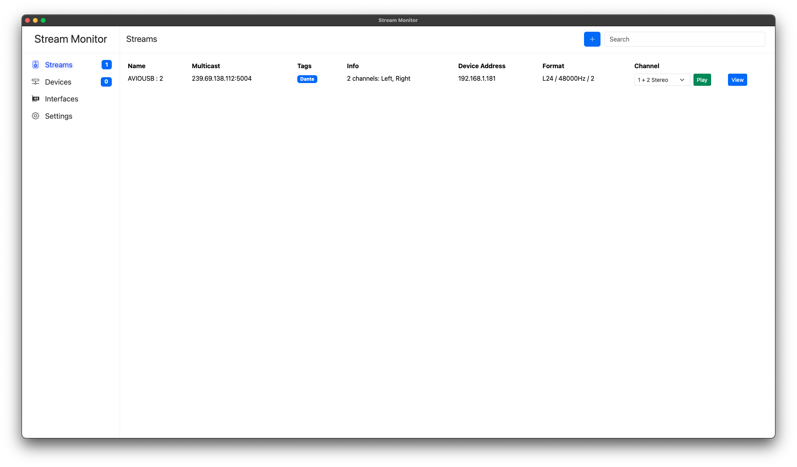
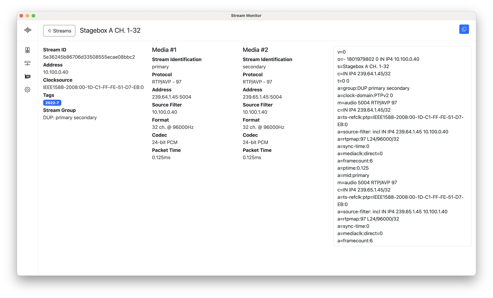

# Stream Monitor

Cross plattform Audio over IP monitoring app. The app was primarily tested in a hybrid Dante/AES67 environment. Features include:

- Auto discovery of streams via Session Announcement Protocol and manually adding streams by pasting SDP data
- Filter and sort streams
- listen to streams by selecting which channels you want to listen to (Stereo and Mono supported)
- wide format support: 44100Hz, 48000Hz and 96000Hz (and more) if the soundcard supports it, L16 and L24 PCM with up to 64 channels and all packet times according to AES67 spec are supported
- Settings for Network interface, audio device, buffering for RTP and more

Here are some screenshots of how the app looks:




## Installation

```
git clone https://github.com/philhartung/aes67-monitor.git
cd aes67-monitor
npm install
```

The app should then be installed. Audify (audio backend used) prebuilds are available for most major platforms and Node versions. If you need to build Audify from source, see https://github.com/almogh52/audify#requirements-for-source-build.

After installation you can start the app with `npm start`.

## Building

To build a binary for your system, first install the app and then run:

```
npm run build
```

This will create a folder for your platform and CPU architecture, containing the binary.

## Development

### Compiles and hot-reloads for development

```
npm run serve
```

### Compiles and start electron for development

```
npm start
```

### Lints and fixes files

```
npm run lint
npm run format
```
