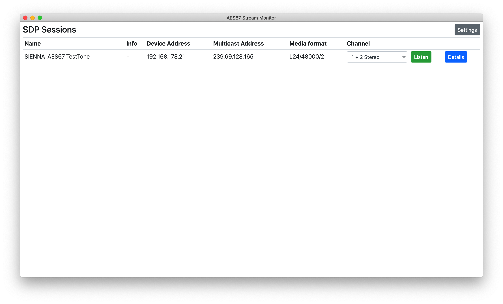
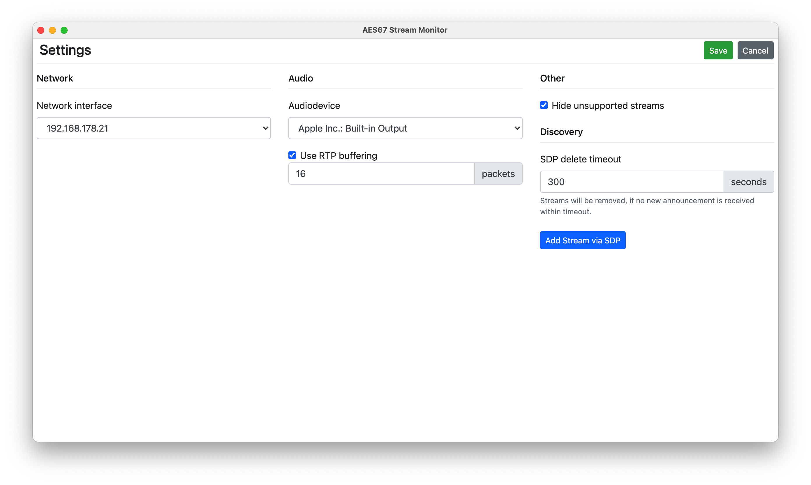

# AES67 Monitor App
Cross plattform AES67 monitoring app. The app was primarily tested in a hybrid Dante/AES67 environment. Features include:
 * Auto Discovery via Session Announcement Protocol and manual adding streams by pasting SDP data is supported
 * Filter and sort streams
 * listen to streams by selecting which channels you want to listen to (Stereo and Mono supported)
 * wide format support: 44100Hz, 48000Hz and 96000Hz (and more) if the soundcard supports it, L16 and L24 PCM, all packet times according to AES67 spec are supported and any other ptime should work as well and 1 to 8 channels are supported
 * Settings for Network interface, audio device, buffering for RTP and more

Here are some screenshots of how the app looks:




## Installation
```
git clone https://github.com/philhartung/aes67-monitor.git
cd aes67-monitor
npm install
```
The app should then be installed.  Audify (audio backend used) prebuilds are available for most major platforms and Node versions. If you need to build Audify from source, see https://github.com/almogh52/audify#requirements-for-source-build.

After installation you can start the app with `npm start`.

## Building
To build a binary for your system, first install the app and then run:
```
npm run build
```
This will create a folder for your platform and CPU architecture, containing the binary.

## Status
This app is still in early development. Some things that need to be reworked before a more stable release include, but are not limited to:
 * ~~rewrite RTP audio backend to support more audio formats (it is currently limited to 48000Hz L24 at 48 samples/packet and quite buggy, also add the option for buffering)~~ done
 * ~~rewrite SDP module and SAP backend~~ done
 * ~~proper support for settings~~ done
 * needs a lot more testing
 
 Also I would like to add more features such as:
  * dBFS and LUFS metering
  * ~~possibility to add streams from raw sdp~~ done
  * RTP packet monitoring (like seqnum, timestamp, etc)
  * ~~make the table sortable~~ done
 

## License and copyright notice
This repository contains code under the MIT License from [twbs/bootstrap](https://github.com/twbs/bootstrap).
