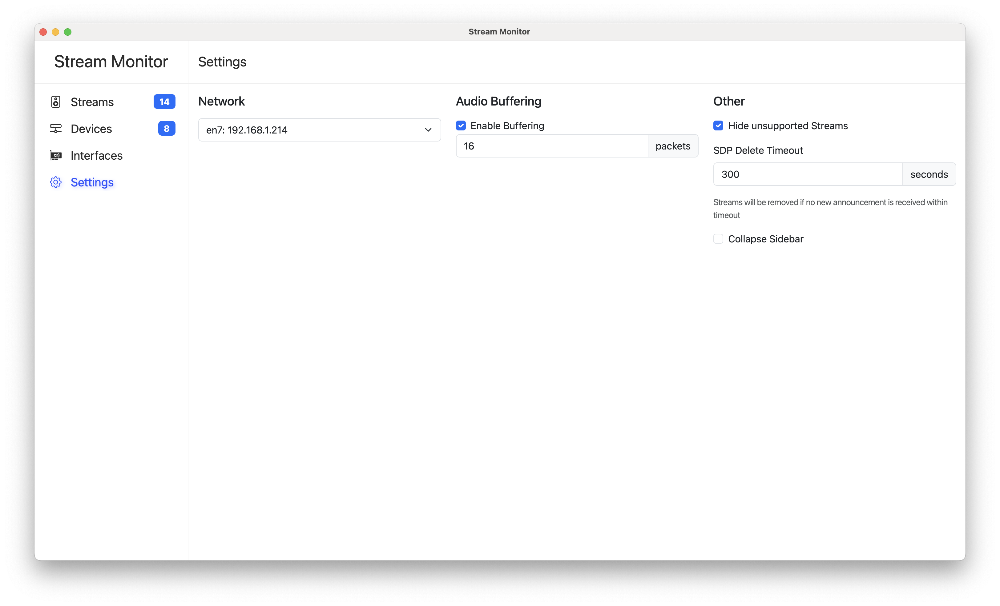

# Stream Monitor

AES67 Stream Monitor is a cross-platform Audio-over-IP monitoring application designed for live sound, studio, and broadcast environments. Tested with AES67-compatible Dante hardware, it offers a comprehensive set of features for managing and analyzing Audio-over-IP streams:

- **Extensive Format Support:** Supports the full range of audio formats as defined by the AES67, RAVENNA, and ST 2110-30 standards — delivering uncompressed L16 and L24 PCM audio across up to 64 channels, with various sampling rates (48000Hz, 96000Hz, and more) and all packet times specified by these standards, subject to your soundcard’s capabilities.
- **Automatic Discovery:** Detects AES67 streams automatically via the Session Announcement Protocol. Additionally, users can manually add streams by adding raw SDP data.
- **Stream Filtering and Sorting:** Easily filter and sort streams to quickly locate the channels you need.
- **Selective Channel Listening:** Choose specific channels to listen to, with support for both stereo pairs and individual mono channels.
- **Customizable Settings:** Configure network interfaces, audio devices, RTP buffering, and other parameters.

Below are some screenshots showcasing the application's interface:




## Installation

```
git clone https://github.com/philhartung/aes67-monitor.git
cd aes67-monitor
npm install
```

This installs all dependencies for your platform. Audify (the audio backend used) prebuilds are available for most major platforms and NodeJS versions. If you need to build Audify from source, see [Build Audify from Source](https://github.com/almoghamdani/audify#requirements-for-source-build).

## Building

Refer to the [Installation](#installation) section for setup instructions. After a successful installation, build the binary for your system by running:

```
npm run build
```

This will create the binaries for the current platform (MacOS, Windows, Linux).

## Development

### Compiles and hot-reloads frontend for development

```
npm run serve
```

### Start electron for development

You will have to run `npm run serve` too for the frontend.

```
npm start
```

### Lints and fixes files

```
npm run lint
npm run format
```
