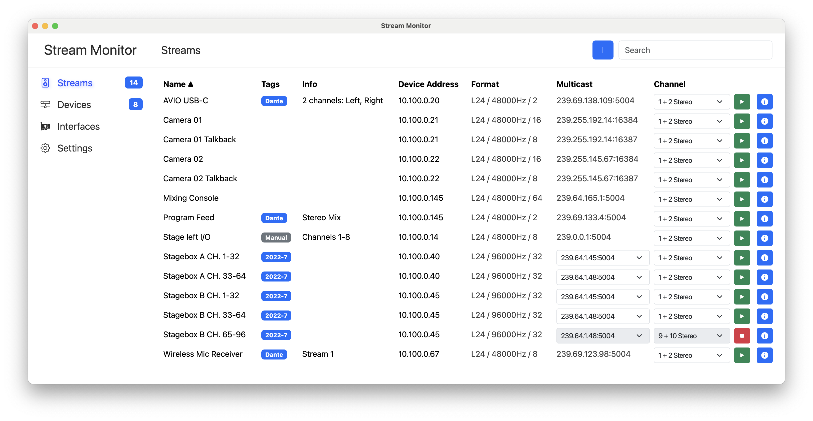

# AES67 Stream Monitor

[](https://github.com/philhartung/aes67-monitor)
[](https://github.com/philhartung/aes67-monitor?tab=MIT-1-ov-file)
[](https://github.com/philhartung/aes67-monitor/releases/latest)

AES67 Stream Monitor is a cross-platform Audio-over-IP monitoring application designed for live sound, studio, and broadcast environments. Tested with AES67-compatible Dante hardware, it offers a comprehensive set of features for managing and analyzing Audio-over-IP streams:

- **Extensive Format Support:** Supports the full range of audio formats as defined by the AES67, RAVENNA, and ST 2110-30 standards — delivering uncompressed L16 and L24 PCM audio across up to 64 channels, with various sampling rates (48000Hz, 96000Hz, and more) and all packet times specified by these standards, subject to your soundcard’s capabilities.
- **Automatic Discovery:** Detects AES67 streams automatically via the Session Announcement Protocol. Additionally, users can manually add streams by adding raw SDP data.
- **Stream Filtering and Sorting:** Easily filter and sort streams to quickly locate the channels you need.
- **Selective Channel Listening:** Choose specific channels to listen to, with support for both stereo pairs and individual mono channels.
- **Customizable Settings:** Configure network interfaces, audio devices, RTP buffering, and other parameters.

Below are some screenshots showcasing the application's interface:



## Installation

See the [lastest release](https://github.com/philhartung/aes67-monitor/releases/latest) for ready-to-use binaries for MacOS, Windows and Linux. Please note that the binaries are currently not signed.

## Installation and Building from source

```
git clone https://github.com/philhartung/aes67-monitor.git
cd aes67-monitor
npm install
```

This installs all dependencies for your platform. Audify (the audio backend used) prebuilds are available for most major platforms and NodeJS versions. If you need to build Audify from source, see [Build Audify from Source](https://github.com/almoghamdani/audify#requirements-for-source-build).

After a successful installation, build the binary for your system by running:

```
npm run build
```

This will create the binaries for the current platform (MacOS, Windows, Linux).

## Development

### Compiles and hot-reloads frontend for development

```
npm run serve
```

### Start electron for development

You will have to run `npm run serve` too for the frontend.

```
npm start
```

### Lint and format files

```
npm run lint
npm run format
```

## Testing

New releases of the AES67 Stream Monitor are tested using both AES67-compliant hardware and software to ensure reliable stream discovery and accurate audio playback. Testing is primarily conducted on macOS, with additional testing performed on Windows. Furthermore, new releases may be tested by [partners](#partners) on various hardware and platforms.

### Hardware

The following hardware devices are used during testing:

| Manufacturer | Device                       | AoIP Protocol        | Discovery                                            | Codec | Sample Rate | Channels per Stream | Packet Time |
| ------------ | ---------------------------- | -------------------- | ---------------------------------------------------- | ----- | ----------- | ------------------- | ----------- |
| Audinate     | AVIO USB-C                   | AES67 (Dante flavor) | [SAP](https://datatracker.ietf.org/doc/html/rfc2974) | L24   | 48 kHz      | 1 – 2               | 1 ms        |
| Behringer    | WING Compact w/ Dante Module | AES67 (Dante flavor) | [SAP](https://datatracker.ietf.org/doc/html/rfc2974) | L24   | 48 kHz      | 1 – 8               | 1 ms        |
| Blackmagic   | 2110 IP Mini BiDirect 12G    | ST 2110-30           | [NMOS](https://specs.amwa.tv/nmos/)                  | L24   | 48 kHz      | 2 – 16              | 0.125 ms    |

### Software-Generated Streams

GStreamer is used to generate AES67-compliant RTP streams with the following configurations:

| Codec | Sample Rate | Channels | Packet Time |
| ----- | ----------- | -------- | ----------- |
| L16   | 44.1 kHz    | 1        | 1 ms        |
| L16   | 44.1 kHz    | 8        | 1 ms        |
| L16   | 48 kHz      | 1        | 0.125 ms    |
| L16   | 48 kHz      | 1        | 1 ms        |
| L16   | 48 kHz      | 2        | 4 ms        |
| L16   | 48 kHz      | 4        | 2 ms        |
| L16   | 48 kHz      | 8        | 0.125 ms    |
| L16   | 48 kHz      | 8        | 1 ms        |
| L16   | 48 kHz      | 64       | 0.125 ms    |
| L16   | 96 kHz      | 1        | 0.125 ms    |
| L16   | 96 kHz      | 1        | 1 ms        |
| L16   | 96 kHz      | 4        | 1 ms        |
| L16   | 96 kHz      | 8        | 0.125 ms    |
| L16   | 96 kHz      | 32       | 0.125 ms    |
| L24   | 44.1 kHz    | 1        | 1 ms        |
| L24   | 44.1 kHz    | 8        | 1 ms        |
| L24   | 48 kHz      | 1        | 0.125 ms    |
| L24   | 48 kHz      | 1        | 1 ms        |
| L24   | 48 kHz      | 2        | 4 ms        |
| L24   | 48 kHz      | 4        | 2 ms        |
| L24   | 48 kHz      | 8        | 0.125 ms    |
| L24   | 48 kHz      | 8        | 1 ms        |
| L24   | 48 kHz      | 64       | 0.125 ms    |
| L24   | 96 kHz      | 1        | 0.125 ms    |
| L24   | 96 kHz      | 1        | 1 ms        |
| L24   | 96 kHz      | 4        | 1 ms        |
| L24   | 96 kHz      | 8        | 0.125 ms    |
| L24   | 96 kHz      | 32       | 0.125 ms    |

For details on the software testing implementation and SDP files, please refer to [philhartung/aoip-tester](https://github.com/philhartung/aoip-tester).

## Partners

This section is dedicated to partners supporting the development of AES67 Stream Monitor. Partners listed here provide resources that help advance the project in various ways. This may include testing new releases on AoIP hardware by the partner, supplying hardware for testing, or offering financial support for new features or the general development of AES67 Stream Monitor. Partners are essential to ensure that AES67 Stream Monitor works as expected and to provide critical feedback on which features are needed for wider adoption.

Partners receive higher priority for bug reports & feature requests, are provided early access builds and are listed in this section. Partners also have a direct channel of communication and receive feedback on any hardware they provide for testing. If you're interested in becoming a partner, feel free to reach out via email at partners [at] aes67.app.

### Current Project Partners

| Partner                                                                                     | Type of Partnership | Description                                                                                                                                                                                                                                |
| ------------------------------------------------------------------------------------------- | ------------------- | ------------------------------------------------------------------------------------------------------------------------------------------------------------------------------------------------------------------------------------------ |
| <a href="https://hochschulradio-aachen.de"><picture><source media="(prefers-color-scheme: dark)" srcset=".doc/logo-hochschulradio-dark.png"><source media="(prefers-color-scheme: light)" srcset=".doc/logo-hochschulradio-light.png"></picture></a> | Testing & Feedback  | RWTH Aachen University's campus radio station is a founding partner and has played a key role since the beginning of the project. Every new release is tested on their hybrid Dante / AES67 network in a real-world broadcast environment. |
